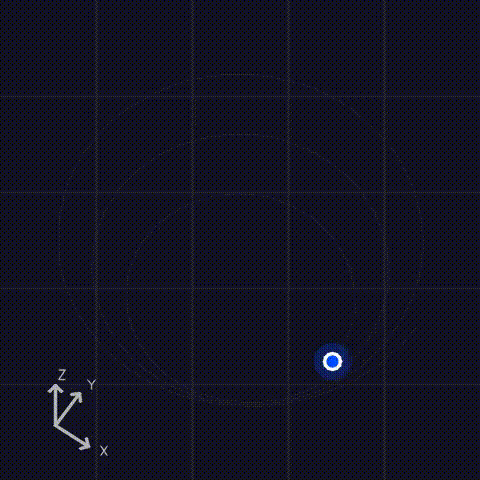

# trajviz

Fast 3D camera trajectory video renderer using NumPy + OpenCV.

Renders animated top-down trajectory visualizations from 3D camera positions, with configurable ghost trails, color-coded markers, glow effects, and camera frustum overlays. Frames are piped directly to ffmpeg as raw RGB — no intermediate files.

<p align="center">
  
</p>

> *Spiral trajectory with wedge frustum overlay. Colors encode time progression: blue at the start, magenta at the end. Generated by [`scripts/generate_demo.py`](scripts/generate_demo.py).*

Colors are user-provided as RGBA per position `(n, 4)`, so they can encode anything. The renderer draws each segment with its assigned color and smoothly advances through the trajectory.

### Coloring strategies

**Time gradient** — show trajectory progression:

```python
t = np.linspace(0, 1, n, dtype=np.float32)
colors = np.stack([t, np.zeros(n), 1 - t, np.ones(n)], axis=1, dtype=np.float32)
```

**Floor / zone coloring** — assign colors by vertical position:

```python
colors = np.zeros((n, 4), dtype=np.float32)
colors[:, 3] = 1.0  # full opacity
for i, z in enumerate(positions[:, 2]):
    if z < 3.0:
        colors[i, :3] = [0.2, 0.5, 0.9]   # blue = ground floor
    elif z < 6.0:
        colors[i, :3] = [0.9, 0.5, 0.1]   # orange = first floor
    else:
        colors[i, :3] = [0.1, 0.8, 0.4]   # green = second floor
```

**Speed-based** — highlight fast vs slow movement:

```python
deltas = np.linalg.norm(np.diff(positions, axis=0), axis=1)
speed = np.concatenate([[deltas[0]], deltas])
speed_norm = (speed - speed.min()) / (speed.max() - speed.min() + 1e-8)
colors = plt.get_cmap("coolwarm")(speed_norm).astype(np.float32)
```

**Uniform** — single color for the entire trajectory:

```python
colors = np.tile([0.2, 0.8, 0.4, 1.0], (n, 1)).astype(np.float32)
```

## Installation

```bash
pip install git+https://github.com/affromero/trajviz.git
```

## Usage

```python
import numpy as np
from trajviz import render_trajectory_video, TrajectoryRenderConfig

# Random 3D trajectory
positions = np.random.randn(120, 3).astype(np.float32)
positions = np.cumsum(positions * 0.1, axis=0)

# RGBA colors per frame (e.g., gradient from blue to red)
t = np.linspace(0, 1, 120)
colors = np.stack([t, np.zeros(120), 1 - t, np.ones(120)], axis=1).astype(np.float32)

render_trajectory_video(
    positions=positions,
    colors_rgba=colors,
    output_path="trajectory.mp4",
)
```

### Configuration

All rendering options are controlled via `TrajectoryRenderConfig`:

```python
from trajviz import TrajectoryRenderConfig, FrustumStyle

config = TrajectoryRenderConfig(
    width=1080,
    height=1080,
    elevation_deg=45.0,
    frustum_style=FrustumStyle.WEDGE,
    fps=30,
)

render_trajectory_video(positions, colors, "out.mp4", config=config)
```

### Side-by-side comparison

Combine a recording with its trajectory overlay:

```python
from trajviz import combine_videos_side_by_side

combine_videos_side_by_side(
    left_path="recording.mp4",
    right_path="trajectory.mp4",
    output_path="combined.mp4",
    fps=30,
)
```

## Development

```bash
pip install -e ".[dev]"
pre-commit install

# Run tests
pytest tests/ -v

# Run linting
pre-commit run --all-files
```

## Requirements

- Python >= 3.10
- ffmpeg on PATH
- numpy, opencv-python-headless, pydantic, jaxtyping, beartype, difflogtest
